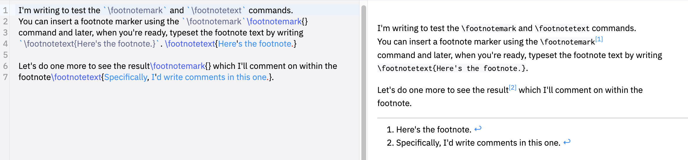

# Footnotes

## The `\footnote` command

The `\footnote` command is the core LaTeX command for creating footnotes and takes two forms:

- `\footnote{text for footnote}`: This inserts an (automatically-generated) superscript number, called the footnote marker, into the document text and also creates the corresponding footnote at the bottom of the page, containing the corresponding footnote marker and text for footnote.
- `\footnote[number]{text for footnote}`: This form of the command uses the optional value number to create the superscript footnote marker; it also inserts the corresponding footnote at the bottom of the page, containing the identifying footnote marker (number) and text for footnote.

## Example: using the `\footnote` command

Here is an example which demonstrates the two variants of `\footnote`:

- `\footnote{Automatically generated footnote markers work fine!}` automatically typesets the numeric (superscript) value (1) for the footnote marker, whereas
- `\footnote[42]{...is that the answer to everything?}` uses 42 as the value of the footnote marker and, as you may observe, it does not increment the integer used for auto-creation of markers: the third footnote has a marker value of 2.

```tex
I'm writing to demonstrate use of automatically-generated footnote markers\footnote{Automatically generated footnote markers work fine!} and footnotes which use a marker value provided to the command\footnote[42]{...is that the answer to everything?}. 

Now, I will use another automatically-generated footnote marker\footnote{Now, footnote markers are 1, 42, but then back to 2? That will be confusing if the automatically-generated number also reaches 42!}.
```

This example produces the following output:


## The `\footnotemark` and `\footnotetext` commands

In addition to `\footnote`, LaTeX provides the commands:

- `\footnotemark` which typesets the footnote marker, and
- `\footnotetext` which typesets the footnote text

Both commands take an optional argument enclosed in square brackets (`[...]`):

- `\footnotemark[number]`: typesets a footnote marker at the point the command is used but does not create/typeset a corresponding footnote at the bottom of the page.
  - `[number]` is the optional argument, specifying that the value number should be used for the footnote marker.
  - If you use this command without the optional argument, writing it as `\footnotemark`, this form of the command generates the footnote marker using an internal LaTeX variable called a counter variable—which is incremented by 1 when the optional number value is not provided.
  
- `\footnotetext[number]{text for footnote}`: typesets the footnote text (text for footnote) corresponding to the marker produced by the previous `\footnotemark`.
  - `[number]` is the optional argument which specifies the corresponding footnote marker for the text for footnote.
  - If you use this command without the optional number argument, i.e. writing it as `\footnotetext{text for footnote}`, this form of the command generates a footnote whose marker corresponds to the most recent `\footnotemark`.

## Example: using `\footnotemark` and `\footnotetext`

The `\footnotemark` and `\footnotetext` commands are often used together to construct footnotes in tables, or other locations, where the standard `\footnote` command does not work, or is not the best/optimal solution.

```tex
I'm writing to test the `\footnotemark` and `\footnotetext` commands. 
You can insert a footnote marker using the `\footnotemark`\footnotemark{}
command and later, when you're ready, typeset the footnote text by writing 
`\footnotetext{Here's the footnote.}`. \footnotetext{Here's the footnote.}

Let's do one more to see the result\footnotemark{} which I'll comment on within the
footnote\footnotetext{Specifically, I'd write comments in this one.}.
```

This example produces the following output:


