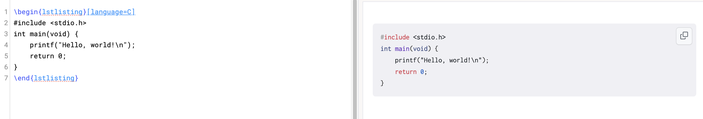
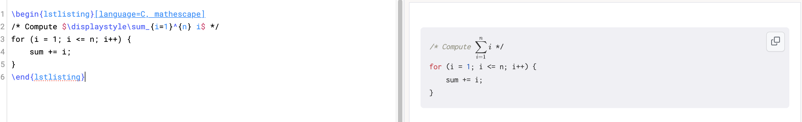
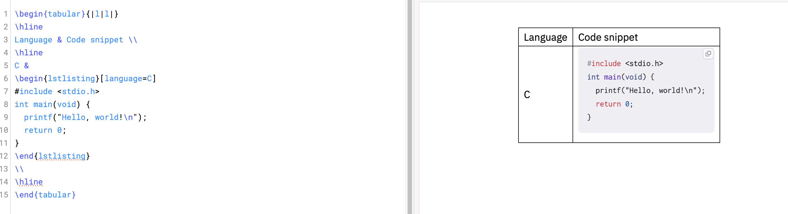

# LaTeX `lstlisting`

Mathpix Markdown now supports LaTeX-style code blocks using
`\begin{lstlisting}...\end{lstlisting}` — similar to the **LaTeX `listings`** package.
These blocks allow you to include formatted and syntax-highlighted source code inside Markdown documents.

## Basic Syntax

```tex
\begin{lstlisting}
printf("Hello, world!\n");
\end{lstlisting}
```

When rendered, this produces a formatted code block, just like a fenced code block in Markdown (```).

## Supported Attributes

You can add optional attributes inside square brackets:

| Attribute    | Example                               |	Description                                                                                                                         |
|:-------------|:--------------------------------------|:---------------------------------------------------------------------------------------------------------------------------------------|
| `language`   | `\begin{lstlisting}[language=C]`      | Programming language for syntax highlighting. All highlight.js languages are supported (e.g., C, Python, JavaScript, Rust, TeX, bash).	|
| `mathescape` | `\begin{lstlisting}[mathescape=true]` | Allows inline LaTeX math (`$...$` or `\( ... \)`) inside the code block.                                                               |

## Examples

### Example 1: Basic C Code

```tex
\begin{lstlisting}[language=C]
#include <stdio.h>
int main(void) {
    printf("Hello, world!\n");
    return 0;
}
\end{lstlisting}
```



### Example 2: Inline Math with `mathescape`

```tex
\begin{lstlisting}[language=C, mathescape]
/* Compute $\displaystyle\sum_{i=1}^{n} i$ */
for (i = 1; i <= n; i++) {
    sum += i;
}
\end{lstlisting}
```



### Example 3: Inside a Table

```tex
\begin{tabular}{|l|l|}
\hline
Language & Code snippet \\
\hline
C &
\begin{lstlisting}[language=C]
#include <stdio.h>
int main(void) {
  printf("Hello, world!\n");
  return 0;
}
\end{lstlisting}
\\
\hline
\end{tabular}
```


