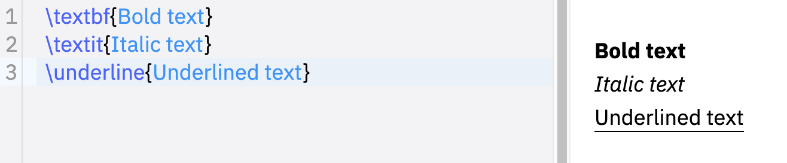
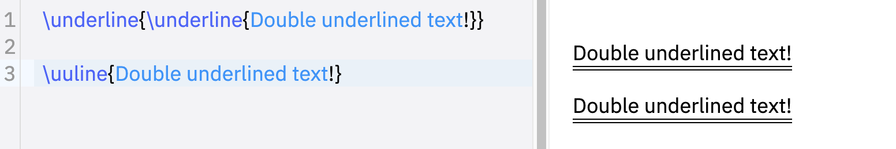
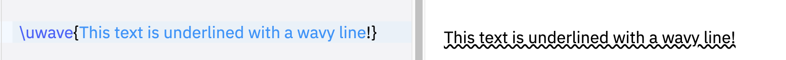
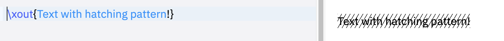
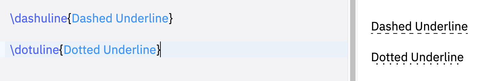

## Underline, bold and italize text

We can print bold, italicized, and underlined text using the commands `\textbf`, `\textit`, and `\underline`, respectively. 

For example:
```
\textbf{Bold text} 
\textit{Italic text}
\underline{Underlined text}
```

This example produces the following output:




## Double underline

Double underlining text can be done easily using the command `\underline` twice or using the command `\uuline`:

```
\underline{\underline{Double underlined text!}}

\uuline{Double underlined text!}
```

produces the output:




## Wavy underlined text

We can easily create wavy underlined text using the command `\uwave{}`. Here is an illustrative example:

```
\uwave{This text is underlined with a wavy line!}
```

which produces the following result:




## Strikethrough text

The command `\sout{}` which can be used to strikethrough text. Check this example:

```
\sout{Text with a horizontal line through its center!}
```

compiling this code yields:


## Slash through letter

The command `\xout{}` can be used to create a hatching effect through text. Here is a basic usage of this command:

```
\xout{Text with hatching pattern!}
```

This code yields the following:




## Dashed and dotted underline

The commands `\dashuline{}` and `\dotuline{}` as their names state can be used to create dashed and dotted lines under text respectively. Check the following code:

```
\dashuline{Dashed Underline}

\dotuline{Dotted Underline}
```

which produces the following output:


