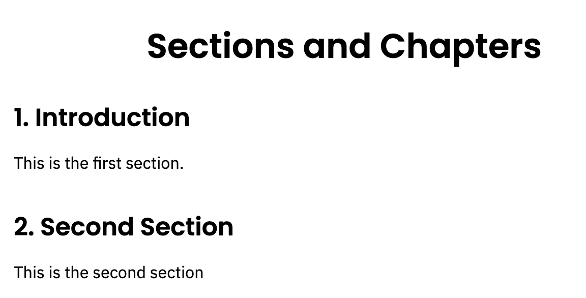
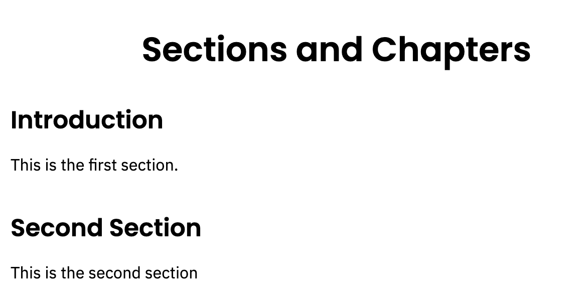
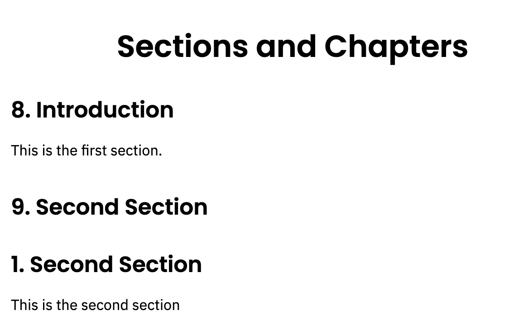
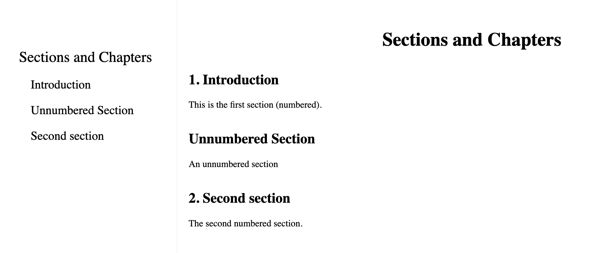

# Sections

## Basic example

Let’s begin with a basic example to demonstrate the `\section{section title}` command, which marks the beginning of a new section called section title. Section numbering is automatic and can be customized, or disabled.

```tex
\title{Sections and Chapters}

\section{Introduction}

This is the first section.

\section{Second Section}
This is the second section
```

This example produces the following output:



## Document sectioning

| levels |                               |
| :----: |:------------------------------|
|1       |`\section{section}`            |
|2       |`\subsection{subsection}`      |
|3       |`\subsubsection{subsubsection}`|


## Numbered and unnumbered sections

To get an unnumbered chapter, section, subsection, etc. add an asterisk `(*)` at the end of the command, before the opening curly brace. These will not go into the table of contents. Here is our first example (above) but this time using `\section*` instead of `\section`:

```tex
\title{Sections and Chapters}

\section*{Introduction}

This is the first section.

\section*{Second Section}
This is the second section
```

This example produces the following output:




## Start section counter from specific number

`\setcounter{section}{number}`
Sets count for `section` to contain the value number.

- *Note:* number can be positive or negative.

```tex
\title{Sections and Chapters}

\setcounter{section}{7}

\section{Introduction}

This is the first section.

\setcounter{section}{0}
\section{Second Section}
This is the second section
```

This example produces the following output:




## Unnumbered sections in the table of contents

To add an unnumbered section to the table of contents, use the `\addcontentsline` command like this:

`\addcontentsline{toc}{section}{Title of the section}`
Here is an example using `\addcontentsline`:

```tex
[[toc]]

\title{Sections and Chapters}

\section{Introduction}
This is the first section (numbered).

\addcontentsline{toc}{section}{Unnumbered Section}
\section*{Unnumbered Section}
An unnumbered section


\section{Second section}
The second numbered section.
```

 This example produces the following output:
 
 
