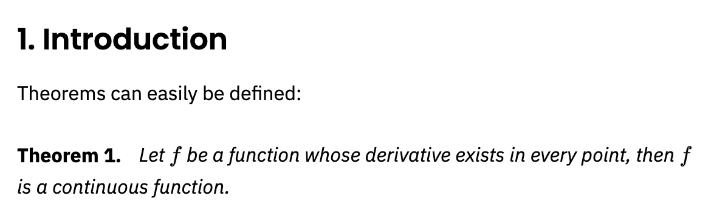
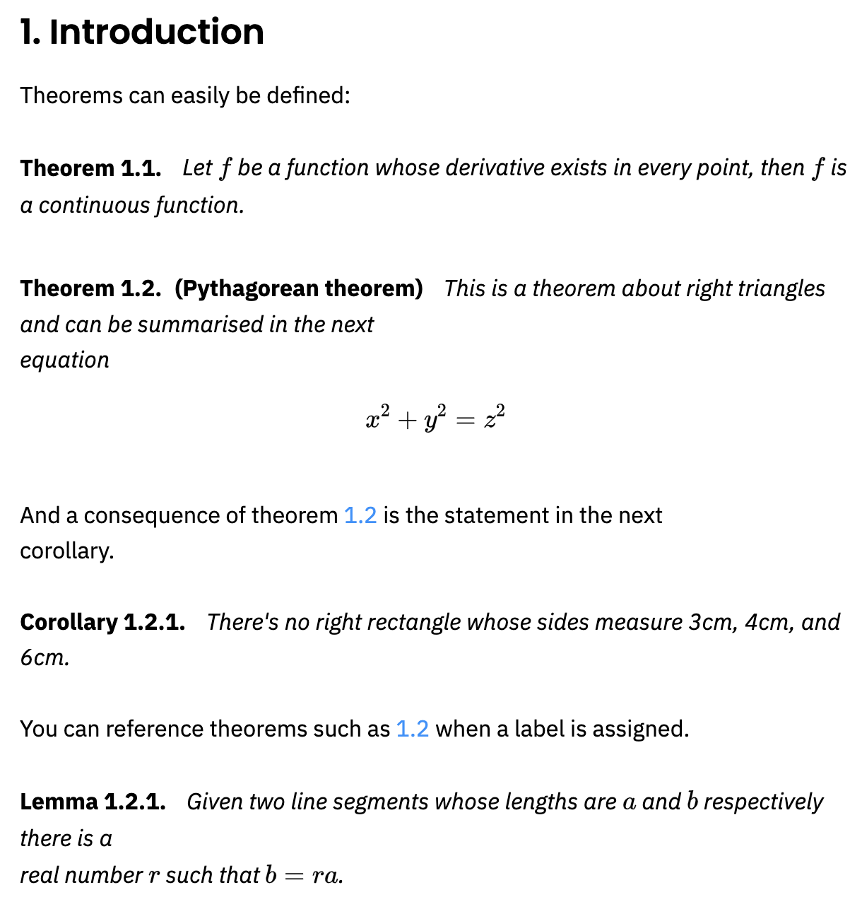
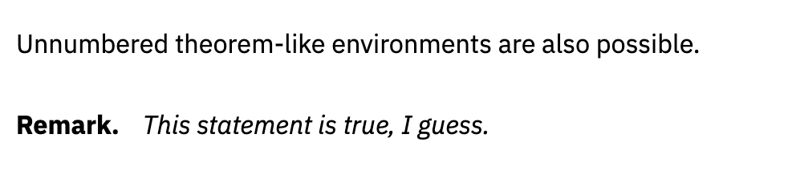
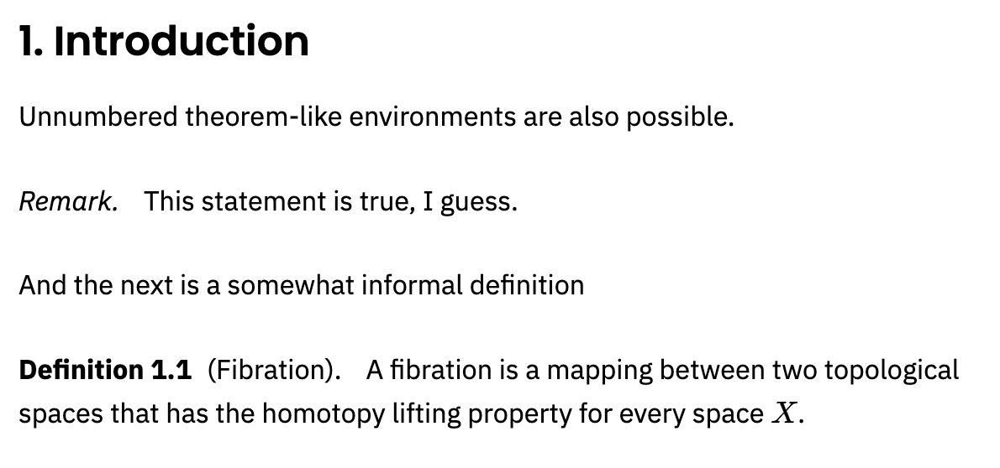
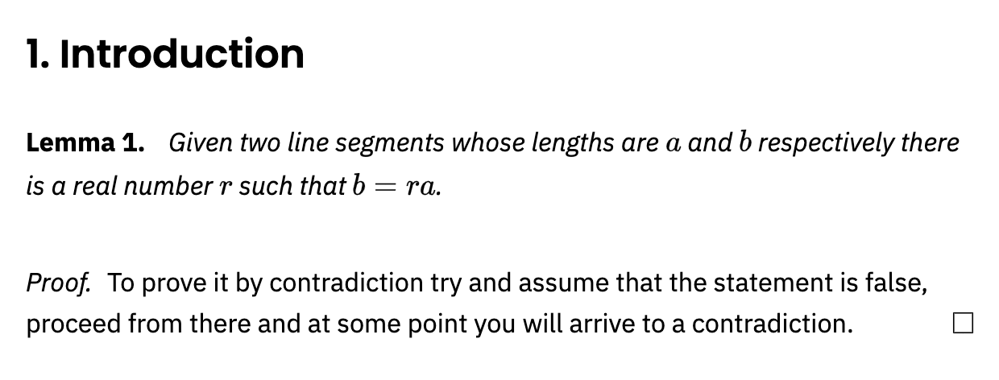
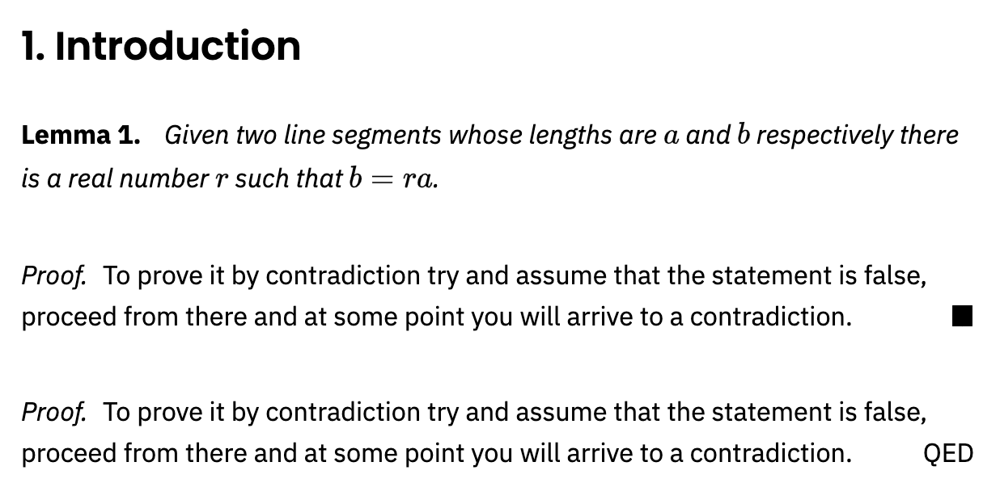
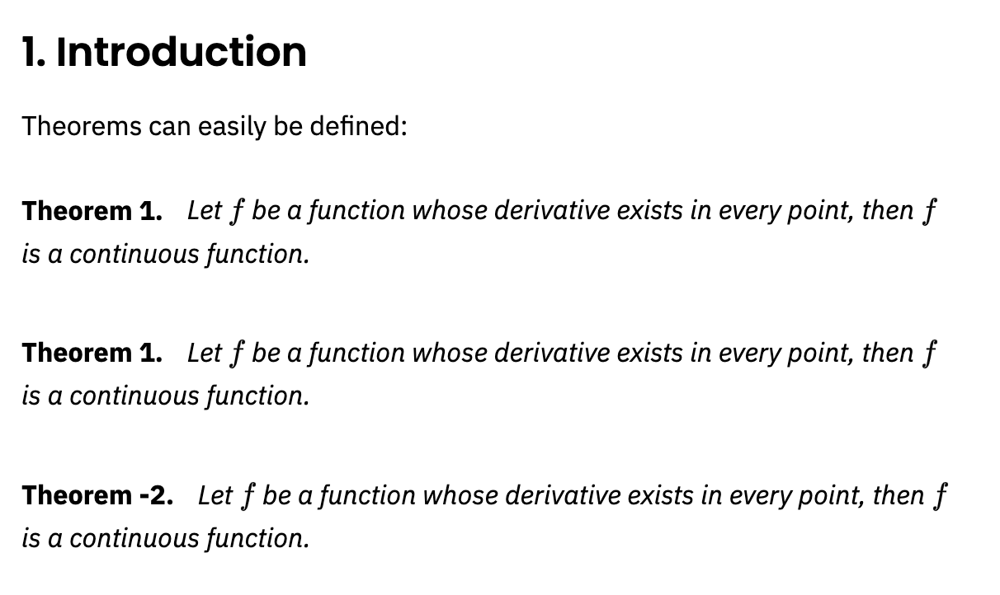

# Theorems and proofs

## Introduction

Mathematical documents include elements that require special formatting and numbering such as theorems, definitions, propositions, remarks, corollaries, lemmas and so on. This article explains how to define these environments in LaTeX.

Numbered environments in LaTeX can be defined by means of the command `\newtheorem` which takes two arguments:

```tex
\newtheorem{theorem}{Theorem}
```

- the first one is the name of the environment that is defined
- the second one is the word that will be printed, in boldface font, at the beginning of the environment.

Once this new environment is defined it can be used normally within the document, delimited by `\begin{theorem}` and `\end{theorem}`. An example is presented below:

```tex
\newtheorem{theorem}{Theorem}

\section{Introduction}
Theorems can easily be defined:

\begin{theorem}
Let \(f\) be a function whose derivative exists in every point, then \(f\) 
is a continuous function.
\end{theorem}
```

This example produces the following output:




## Numbered theorems, definitions, corollaries and lemmas

The numbering of the environments can be controlled by means of two additional parameters in the `\newtheorem` command. Let's see:

```tex
\newtheorem{theorem}{Theorem}[section]
\newtheorem{corollary}{Corollary}[theorem]
\newtheorem{lemma}[theorem]{Lemma}

\section{Introduction}
Theorems can easily be defined:

\begin{theorem}
Let \(f\) be a function whose derivative exists in every point, then \(f\) is 
a continuous function.
\end{theorem}

\begin{theorem}[Pythagorean theorem]
\label{pythagorean}
This is a theorem about right triangles and can be summarised in the next 
equation 
\[ x^2 + y^2 = z^2 \]
\end{theorem}

And a consequence of theorem \ref{pythagorean} is the statement in the next 
corollary.

\begin{corollary}
There's no right rectangle whose sides measure 3cm, 4cm, and 6cm.
\end{corollary}

You can reference theorems such as \ref{pythagorean} when a label is assigned.

\begin{lemma}
Given two line segments whose lengths are \(a\) and \(b\) respectively there is a 
real number \(r\) such that \(b=ra\).
\end{lemma}
```

This example produces the following output:



There are three new environments defined in the preamble.

`\newtheorem{theorem}{Theorem}[section]`
This is the example presented in the introduction, but it has the additional parameter `[section]` that restarts the theorem counter at every new section.

`\newtheorem{corollary}{Corollary}[theorem]`
An environment called corollary is created, the counter of this new environment will be reset every time a new theorem environment is used.

`\newtheorem{lemma}[theorem]{Lemma}`
In this case, the even though a new environment called lemma is created, it will use the same counter as the theorem environment.

Some famous theorems have their own names, for these cases you can add said name inside brackets in the environment opening command. In the example, the line `\begin{theorem}[Pythagorean theorem]` prints "Pythagorean theorem" at the beginning of the paragraph.

As with many other numbered elements in LaTeX, the command `\label` can be used to reference theorem-like environments within the document.


## Unnumbered theorem-like environments

It can be useful to have an unnumbered theorem-like environment to add remarks, comments or examples to a mathematical document.

```tex
\newtheorem*{remark}{Remark}

Unnumbered theorem-like environments are also possible.

\begin{remark}
This statement is true, I guess.
\end{remark}
```

This example produces the following output:




The syntax of the command `\newtheorem*` is the same as the non-starred version, except for the counter parameters. In this example, a new unnumbered environment called remark is created.

## Theorem styles

A feature that is important when working in a mathematical document is to easily tell apart, say, definitions from theorems by its formatting.

```tex
\theoremstyle{definition}
\newtheorem{definition}{Definition}[section]

\theoremstyle{remark}
\newtheorem*{remark}{Remark}

\section{Introduction}
Unnumbered theorem-like environments are also possible.

\begin{remark}
This statement is true, I guess.
\end{remark}

And the next is a somewhat informal definition

\begin{definition}[Fibration]
A fibration is a mapping between two topological spaces that has the homotopy lifting property for every space \(X\).
\end{definition}
```

This example produces the following output:



The command `\theoremstyle{ }` sets the styling for the numbered environment defined right below it. In the example above, the styles *remark* and *definition* are used. Notice that the remark is now in italics and the text in the environment uses normal (Roman) typeface, the definition on the other hand also uses Roman typeface for the text within but the word "Definition" is printed in boldface font.

## Proofs

Proofs are the core of mathematical papers and books, and it is customary to keep them visually apart from the normal text in the document.

```text
\newtheorem{theorem}{Theorem}[section]
\newtheorem{lemma}[theorem]{Lemma}

\section{Introduction}
\begin{lemma}
Given two line segments whose lengths are \(a\) and \(b\) respectively there 
is a real number \(r\) such that \(b=ra\).
\end{lemma}

\begin{proof}
To prove it by contradiction try and assume that the statement is false,
proceed from there and at some point you will arrive to a contradiction.
\end{proof}
```

This example produces the following output:



## Changing the QED symbol

The symbol printed at the end of a proof is called the “QED symbol”. To quote the meaning of QED from Wikipedia:

> QED is an initialism of the Latin phrase quod erat demonstrandum, meaning “thus it has been demonstrated”
 
It is straightforward to use a symbol, or wording, of your choice to represent the QED symbol. The command

```tex
\renewcommand\qedsymbol{$\blacksquare$}
```

You can be used to replace the default white square for a black square printed by `$\blacksquare$`, the parameter inside the braces. Or, you can write the word QED explicitly:

```tex
\renewcommand\qedsymbol{QED}
```

Here is an example to demonstrate both options:

```tex
\newtheorem{theorem}{Theorem}[section]
\newtheorem{lemma}[theorem]{Lemma}

\section{Introduction}

\begin{lemma}
Given two line segments whose lengths are \(a\) and \(b\) respectively there 
is a real number \(r\) such that \(b=ra\).
\end{lemma}

\renewcommand\qedsymbol{$\blacksquare$}

\begin{proof}
To prove it by contradiction try and assume that the statement is false,
proceed from there and at some point you will arrive to a contradiction.
\end{proof}

\renewcommand\qedsymbol{QED}

\begin{proof}
To prove it by contradiction try and assume that the statement is false,
proceed from there and at some point you will arrive to a contradiction.
\end{proof}
```

This example produces the following output:




## Start theorem counter from specific number

`\setcounter{theoremenv}{number}`
Sets count for `theoremenv` to contain the value number.

- *Note:* number can be positive or negative.

```tex
\newtheorem{theorem}{Theorem}

\section{Introduction}
Theorems can easily be defined:

\begin{theorem}
Let \(f\) be a function whose derivative exists in every point, then \(f\) 
is a continuous function.
\end{theorem}

\setcounter{theorem}{0}

\begin{theorem}
Let \(f\) be a function whose derivative exists in every point, then \(f\) 
is a continuous function.
\end{theorem}

\setcounter{theorem}{-3}

\begin{theorem}
Let \(f\) be a function whose derivative exists in every point, then \(f\) 
is a continuous function.
\end{theorem}
```

This example produces the following output:




## Reference guide

### *Theorem styles*

- `definition` boldface title, Roman body. Commonly used in definitions, conditions, problems and examples.
- `plain` boldface title, italicized body. Commonly used in theorems, lemmas, corollaries, propositions and conjectures.
- `remark` italicized title, Roman body. Commonly used in remarks, notes, annotations, claims, cases, acknowledgments and conclusions.
