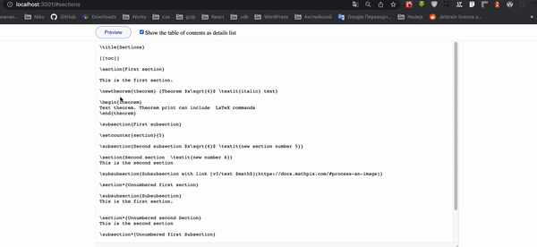

This repository contains example of how to use `getTocContainerHTML()` method in your React app.

## Install

Using [npm](https://www.npmjs.com):

`npm install`

Using [yarn](https://classic.yarnpkg.com):

`yarn install`

## Start

Using [npm](https://www.npmjs.com):

`npm run start`

Using [yarn](https://classic.yarnpkg.com):

`yarn start`

Runs the app in the development mode. 
Open [http://localhost:3000](http://localhost:3000) to view it in the browser.

